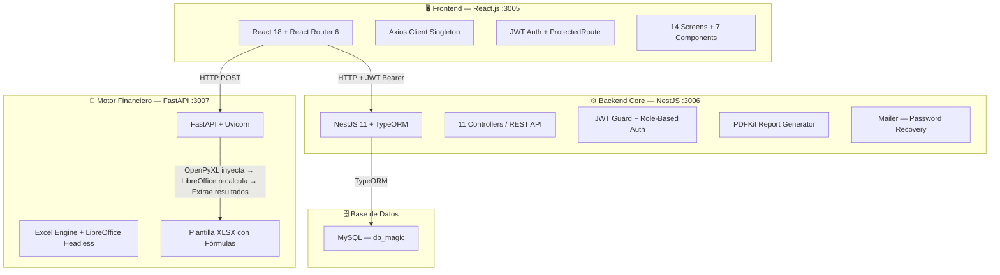
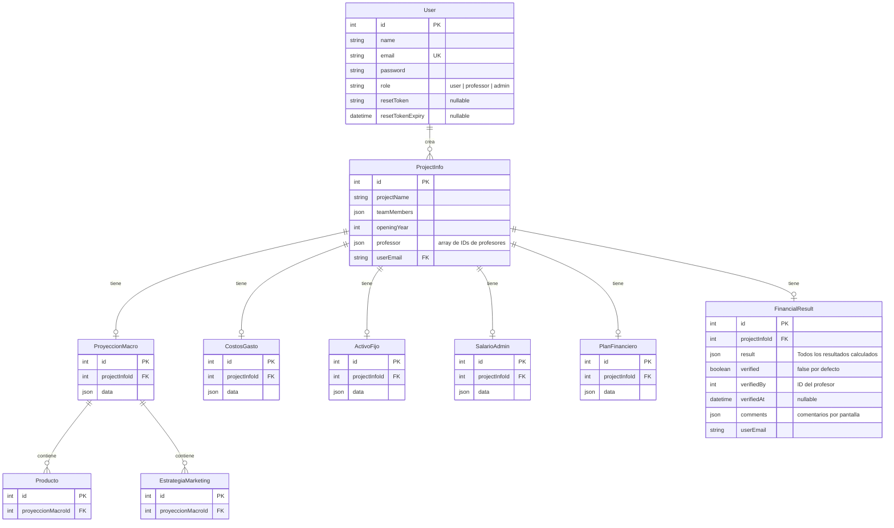
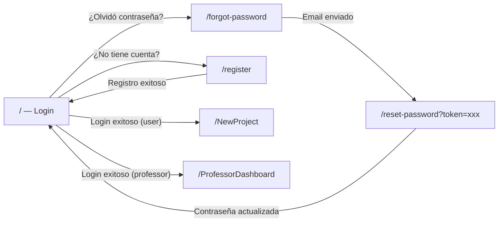
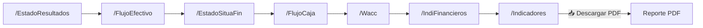
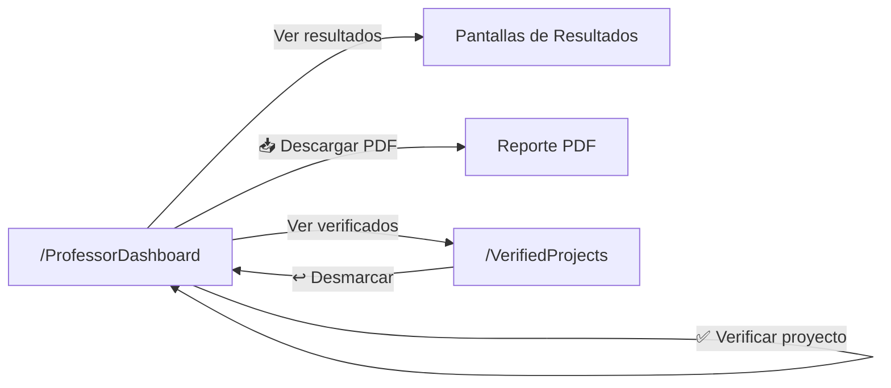
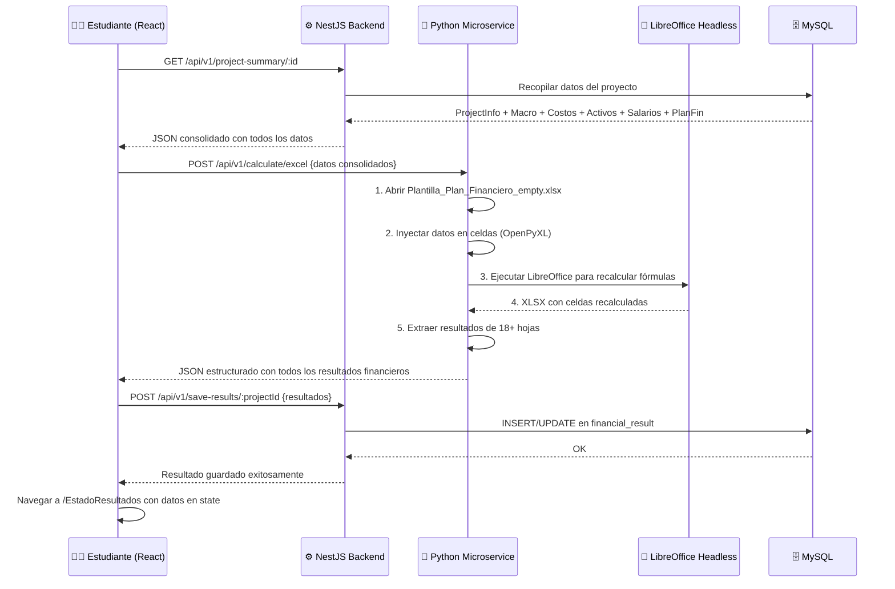
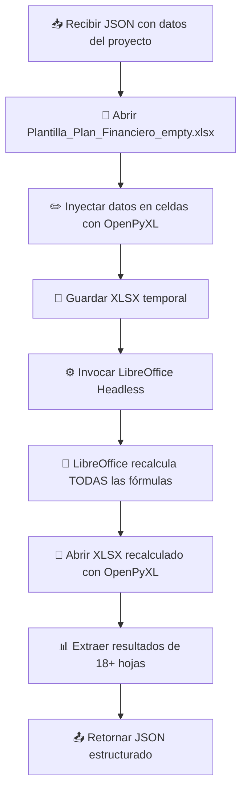

# 📘 Documentación Técnica del Proyecto — Magic CEIPA

**Plataforma de Simulación Financiera para Planes de Negocio** — CEIPA Powered by Arizona State University

Este documento contiene la documentación técnica completa del proyecto: arquitectura, estructura del código, modelo de datos, flujos, endpoints de la API, y la guía paso a paso de configuración y despliegue con Docker.

---

## 📐 Arquitectura General

El proyecto es una aplicación **full-stack de 3 servicios** independientes, comunicados por HTTP y orquestados con Docker Compose. El frontend (React) se comunica con el backend core (NestJS) para operaciones CRUD y autenticación, y con el microservicio Python (FastAPI) para el cálculo financiero pesado que requiere LibreOffice Headless.



---

## 🛠 Stack de Tecnología

| Capa | Tecnología | Puerto | Notas |
|:-----|:-----------|:------:|:------|
| **Frontend** | React 18 (CRA), React Router 6, Axios, Lucide Icons, HeadlessUI, react-hot-toast | `:3005` | Nginx en producción |
| **Backend Core** | NestJS 11, TypeORM, JWT (`@nestjs/jwt`), bcryptjs, PDFKit, `@nestjs-modules/mailer` | `:3006` | Prefijo global `api/v1` |
| **Motor Financiero** | FastAPI, Uvicorn, OpenPyXL, LibreOffice Headless (Alpine Docker) | `:3007` | Recálculo de fórmulas Excel |
| **Base de Datos** | MySQL | `:3307` | `synchronize: true` con TypeORM |
| **Infraestructura** | Docker, Docker Compose (multi-stage: dev + prod) | — | Volúmenes para live-reload en dev |

---

## 📂 Estructura del Proyecto

```
nestReactStudy/
├── docker-compose.yml              # Desarrollo (live-reload con volúmenes)
├── docker-compose.prod.yml         # Producción (Nginx + builds optimizados)
├── README-Docker.md                # Esta documentación
├── mapa_dependencias.png           # Grafo de dependencias entre hojas Excel
│
├── magicFront/magicFront/          # 🖥️ FRONTEND (React)
│   ├── src/
│   │   ├── App.js                  # Router principal (20 rutas)
│   │   ├── components/             # 7 componentes reutilizables
│   │   │   ├── Navbar.js           # Menú condicional por rol
│   │   │   ├── CeipaLoader.js      # Animación de carga (ciclo mínimo 8s)
│   │   │   ├── CeipaLoader.css     # Estilos de la animación
│   │   │   ├── CustomInput.js      # Input reutilizable con validación
│   │   │   ├── ParticleBackground.js # Fondo animado con partículas
│   │   │   ├── ProtectedRoute.js   # Guard de ruta (valida JWT expiration)
│   │   │   └── Footer.js           # Pie de página
│   │   ├── screens/                # 14 carpetas de pantallas
│   │   │   ├── login/              # Inicio de sesión
│   │   │   ├── register/           # Registro de usuarios
│   │   │   ├── forgotPassword/     # Solicitar recuperación
│   │   │   ├── resetPassword/      # Restablecer contraseña
│   │   │   ├── newProject/         # Listado + crear proyectos
│   │   │   ├── projectInfo/        # Información inicial
│   │   │   ├── proyeccionMacro/    # Análisis del entorno
│   │   │   ├── costosGastos/       # Costos y gastos
│   │   │   ├── activosFijos/       # Activos fijos
│   │   │   ├── salarioAdmins/      # Salarios administrativos
│   │   │   ├── planFinanciero/     # Plan financiero + botón calcular
│   │   │   ├── results/            # 7 pantallas de resultados financieros
│   │   │   ├── professorDashboard/ # Dashboard del profesor
│   │   │   └── verifiedProjects/   # Proyectos verificados
│   │   ├── hooks/                  # Custom hooks
│   │   │   ├── useRole.js          # Decodifica rol del JWT
│   │   │   └── useProcessing.js    # Estado de carga con ciclo mínimo
│   │   ├── utils/axios.js          # Cliente HTTP singleton (Axios)
│   │   ├── style/styles.css        # Hoja de estilos global (36KB)
│   │   └── images/                 # Assets estáticos
│   ├── .env                        # REACT_APP_API_URL, REACT_APP_PY_APP_API_URL
│   ├── nginx.conf                  # Configuración de Nginx para producción
│   └── Dockerfile                  # Multi-stage (dev + prod con Nginx)
│
├── nestjs/magic_ceipa/             # ⚙️ BACKEND (NestJS)
│   ├── src/
│   │   ├── app.module.ts           # Módulo raíz (TypeORM MySQL + 10 módulos)
│   │   ├── main.ts                 # Bootstrap: prefix api/v1, CORS, ValidationPipe
│   │   ├── auth/                   # Módulo de autenticación
│   │   │   ├── auth.controller.ts  # Login, Register, Forgot/Reset Password
│   │   │   ├── auth.service.ts     # Lógica de auth + envío de emails
│   │   │   ├── auth.module.ts      # Configuración JWT + Mailer
│   │   │   ├── dto/                # RegisterDto, LoginDto, ForgotPasswordDto, ResetPasswordDto
│   │   │   ├── guard/              # JWT AuthGuard
│   │   │   ├── decorators/         # @Auth() decorator
│   │   │   └── constants/          # JWT secret
│   │   ├── users/                  # CRUD usuarios + roles
│   │   │   ├── entities/user.entity.ts
│   │   │   ├── users.service.ts    # findByEmail, saveResetToken, findByValidResetToken
│   │   │   └── dto/                # CreateUserDto, UpdateUserDto
│   │   ├── project-info/           # CRUD proyectos + Dashboard profesor
│   │   │   ├── entities/project-info.entity.ts
│   │   │   ├── project-info.service.ts # Incluye eliminación en cascada
│   │   │   └── dto/
│   │   ├── proyeccion-macro/       # Análisis del entorno (con sub-entidades)
│   │   │   ├── entities/
│   │   │   │   ├── proyeccion-macro.entity.ts
│   │   │   │   ├── producto.entity.ts
│   │   │   │   └── estrategia-marketing.entity.ts
│   │   │   └── dto/
│   │   ├── costos-gastos/          # Costos y gastos operativos
│   │   ├── activos-fijos/          # Activos fijos e inversión
│   │   ├── salario-admins/         # Salarios administrativos
│   │   ├── plan-financiero/        # Plan financiero (datos de entrada)
│   │   ├── financial-results/      # Resultados calculados + verificación + comentarios
│   │   │   ├── entities/financial-result.entity.ts
│   │   │   ├── financial-results.controller.ts
│   │   │   └── financial-results.service.ts
│   │   ├── project-summary/        # Resumen consolidado de datos del proyecto
│   │   ├── reports/                # Generación de PDF con PDFKit
│   │   │   ├── reports.service.ts  # Servicio principal (28KB)
│   │   │   ├── pdf-helpers.ts      # Utilidades de generación PDF
│   │   │   ├── reports.controller.ts
│   │   │   └── reports.module.ts
│   │   └── common/                 # Utilidades compartidas
│   │       ├── decorators/         # @ActiveUser()
│   │       ├── enums/              # Role (USER, PROFESSOR, ADMIN)
│   │       └── interfaces/         # UserActiveInterface
│   ├── .env                        # DB, CORS, MAIL, FRONTEND_URL
│   └── Dockerfile                  # Multi-stage (dev + prod)
│
├── planfin_microservice/           # 🐍 MICROSERVICIO PYTHON
│   ├── app/
│   │   ├── main.py                 # FastAPI app + CORS
│   │   ├── routers/
│   │   │   └── calculator.py       # Router POST /calculate/excel
│   │   └── services/
│   │       ├── excel_engine.py     # Motor principal (47KB) — inyección a XLSX
│   │       ├── informacion_inicial.py # Mapeo de datos iniciales (32KB)
│   │       ├── estado_resultados.py   # Extracción de resultados (25KB)
│   │       ├── calculator_service.py  # Orquestador del cálculo
│   │       └── base.py             # Clase base de servicio
│   ├── excel_templates/
│   │   └── Plantilla_Plan_Financiero_empty.xlsx  # Template Excel con fórmulas
│   ├── requirements.txt            # fastapi, uvicorn, pydantic, openpyxl
│   └── dockerfile                  # Alpine + LibreOffice Headless
│
└── template_report/                # Template Word para informes
    └── INFORME EVALUACIÓN DE PROYECTOS MAGIC.docx
```

---

## 🗄️ Modelo de Datos (10 Entidades TypeORM)

La base de datos MySQL `db_magic` contiene 10 entidades gestionadas por TypeORM con `synchronize: true`. La entidad principal es `ProjectInfo`, que tiene relaciones 1:1 con cada módulo de datos del proyecto. Los resultados financieros calculados se almacenan como JSON en `FinancialResult`.



> **Nota sobre la eliminación en cascada:** Al borrar un `ProjectInfo`, el servicio elimina manualmente todas las entidades relacionadas (PlanFinanciero, CostosGasto, ActivoFijo, SalarioAdmin, ProyeccionMacro con sus Productos y EstrategiaMarketing, y FinancialResult) antes de eliminar el proyecto principal.

---

## 🖥️ Pantallas del Frontend (20 rutas)

### Flujo Público (sin autenticación)



| Ruta | Pantalla | Descripción |
|:-----|:---------|:------------|
| `/` | Login | Inicio de sesión con email/password + ParticleBackground |
| `/register` | Register | Registro de nuevos usuarios con selección de rol |
| `/forgot-password` | ForgotPassword | Solicitud de recuperación por correo electrónico |
| `/reset-password` | ResetPassword | Restablecimiento con token temporal (15 min) |

### Flujo del Estudiante — Instrucciones (entrada de datos)

```mermaid
graph LR
    NP["/NewProject — Mis Proyectos"] -->|Seleccionar o crear| PI["/ProjectInfo"]
    PI -->|Guardar y siguiente| PM["/ProyeccionMacro"]
    PM -->|Guardar y siguiente| CG["/CostosGastos"]
    CG -->|Guardar y siguiente| AF["/ActivosFijos"]
    AF -->|Guardar y siguiente| SA["/SalarioAdmins"]
    SA -->|Guardar y siguiente| PF["/PlanFinanciero"]
    PF -->|"Calcular (→ Python API)"| ER["/EstadoResultados"]
```



| Ruta | Pantalla | Descripción |
|:-----|:---------|:------------|
| `/NewProject` | NewProject | Listado de proyectos existentes + botón crear nuevo proyecto |
| `/ProjectInfo` | ProjectInfo | Información inicial: nombre del proyecto, equipo, año de apertura, profesores asignados |
| `/ProyeccionMacro` | ProyeccionMacro | Análisis del entorno macro: productos, estrategia de marketing |
| `/CostosGastos` | CostosGastos | Costos y gastos operativos del proyecto |
| `/ActivosFijos` | ActivosFijos | Activos fijos e inversiones requeridas |
| `/SalarioAdmins` | SalarioAdmins | Salarios del personal administrativo |
| `/PlanFinanciero` | PlanFinanciero | Plan financiero completo + botón **Calcular** que invoca al microservicio Python |

### Flujo del Estudiante — Resultados (consulta de datos calculados)



| Ruta | Pantalla | Descripción |
|:-----|:---------|:------------|
| `/EstadoResultados` | EstadoResultados | Estado de resultados proyectado (ingresos, egresos, utilidad) |
| `/FlujoEfectivo` | FlujoEfectivo | Flujo de efectivo operativo, de inversión y financiamiento |
| `/EstadoSituaFin` | EstadoSituaFin | Estado de situación financiera (balance general) |
| `/FlujoCaja` | FlujoCaja | Flujo de caja libre del proyecto |
| `/Wacc` | Wacc | Costo Promedio Ponderado de Capital (WACC) |
| `/IndiFinancieros` | IndiFinancieros | Indicadores financieros (liquidez, endeudamiento, rentabilidad) |
| `/Indicadores` | Indicadores | VPN, TIR, Punto de equilibrio + botón **Descargar Reporte PDF** |

> Cada pantalla de resultados incluye un campo de **comentarios** donde el estudiante puede escribir su análisis. Los comentarios se guardan en la columna JSON `comments` de `FinancialResult`.

### Flujo del Profesor



| Ruta | Pantalla | Descripción |
|:-----|:---------|:------------|
| `/ProfessorDashboard` | ProfessorDashboard | Proyectos asignados al profesor con buscador dinámico (nombre, estudiante, cédula). Permite verificar proyectos y descargar reportes PDF |
| `/VerifiedProjects` | VerifiedProjects | Lista de proyectos ya verificados con opción de desmarcar la verificación |

---

## 🔄 Flujo de Datos Principal (Cálculo Financiero)

Este diagrama muestra el flujo completo desde que el estudiante presiona **"Calcular"** en la pantalla de Plan Financiero hasta que los resultados se guardan en la base de datos:



---

## 🧩 Componentes Reutilizables del Frontend

| Componente | Archivo | Descripción |
|:-----------|:--------|:------------|
| **Navbar** | `components/Navbar.js` | Menú de navegación condicional por rol. Estudiantes ven dropdowns de Instrucciones y Resultados. Profesores ven "Ver asignaciones" y "Verificados". Incluye lógica de decodificación JWT para determinar el rol |
| **CeipaLoader** | `components/CeipaLoader.js` + `.css` | Animación de carga overlay con el logo de CEIPA. Garantiza un ciclo mínimo de 8 segundos para evitar parpadeos en transiciones rápidas |
| **CustomInput** | `components/CustomInput.js` | Input reutilizable con soporte para labels, validación, diferentes tipos y estilos consistentes en toda la aplicación |
| **ParticleBackground** | `components/ParticleBackground.js` | Fondo animado con partículas interactivas renderizadas en canvas. Usado en las pantallas de Login y Register |
| **ProtectedRoute** | `components/ProtectedRoute.js` | Wrapper de `<Outlet>` que decodifica el JWT, valida la expiración (`exp * 1000 < Date.now()`), y redirige a login si el token venció o no existe |
| **Footer** | `components/Footer.js` | Pie de página estático |

### Custom Hooks

| Hook | Archivo | Descripción |
|:-----|:--------|:------------|
| **useRole** | `hooks/useRole.js` | Decodifica el JWT desde localStorage/sessionStorage y retorna `{ role, isProfessor }` |
| **useProcessing** | `hooks/useProcessing.js` | Maneja el estado de carga `isProcessing` con función `runWithLoader()` que envuelve operaciones async con el CeipaLoader |

### Cliente HTTP

| Utilidad | Archivo | Descripción |
|:---------|:--------|:------------|
| **AxiosClient** | `utils/axios.js` | Singleton con dos instancias de Axios: `axiosInstance` (NestJS) y `pythonInstance` (FastAPI). Interceptores automáticos para: inyectar JWT en headers, manejar 401 (redirigir a login), silenciar 404 en GET, y mostrar toasts de error |

---

## 📡 API Endpoints del Backend (NestJS)

Todos los endpoints están bajo el prefijo global **`/api/v1/`** configurado en `main.ts`.

### 🔐 Auth (`/api/v1/auth/`)

| Método | Endpoint | Auth | Descripción |
|:-------|:---------|:-----|:------------|
| `POST` | `/login` | ❌ | Autenticación con email/password. Retorna JWT con `{id, email, role}` |
| `POST` | `/register` | ❌ | Registro de nuevo usuario. Password hasheado con bcryptjs (12 rounds) |
| `POST` | `/forgot-password` | ❌ | Envía email de recuperación con token SHA256 (válido 15 min) |
| `POST` | `/reset-password` | ❌ | Restablece contraseña usando el token del email |
| `GET` | `/profile` | ✅ | Retorna perfil del usuario autenticado |

### 👤 Users (`/api/v1/users/`)

| Método | Endpoint | Auth | Descripción |
|:-------|:---------|:-----|:------------|
| `GET` | `/professors` | ✅ | Lista todos los usuarios con rol `professor` (solo id, name, email) |

### 📁 ProjectInfo (`/api/v1/project-info/`)

| Método | Endpoint | Auth | Roles | Descripción |
|:-------|:---------|:-----|:------|:------------|
| `POST` | `/` | ✅ | USER | Crear proyecto. Valida que no exista duplicado por nombre+email |
| `GET` | `/` | ✅ | USER/ADMIN | Listar proyectos del usuario (admin ve todos) |
| `GET` | `/:id` | ✅ | USER | Obtener proyecto por ID (valida ownership) |
| `PATCH` | `/:id` | ✅ | USER | Actualizar proyecto |
| `DELETE` | `/:id` | ✅ | USER | Eliminar proyecto + todas las entidades relacionadas en cascada |
| `GET` | `/professor/dashboard` | ✅ | PROFESSOR | Dashboard del profesor. `?verified=true` para proyectos verificados |

### 📊 Módulos de Datos del Proyecto

Cada módulo sigue el patrón CRUD estándar de NestJS con validación de ownership:

| Módulo | Prefijo | Descripción |
|:-------|:--------|:------------|
| **ProyeccionMacro** | `/api/v1/proyeccion-macro/` | Análisis del entorno con sub-entidades Producto y EstrategiaMarketing |
| **CostosGastos** | `/api/v1/costos-gastos/` | Costos y gastos operativos |
| **ActivosFijos** | `/api/v1/activos-fijos/` | Activos fijos e inversión |
| **SalarioAdmins** | `/api/v1/salario-admins/` | Salarios administrativos |
| **PlanFinanciero** | `/api/v1/plan-financiero/` | Plan financiero (datos de entrada al cálculo) |

### 📈 ProjectSummary (`/api/v1/project-summary/`)

| Método | Endpoint | Auth | Descripción |
|:-------|:---------|:-----|:------------|
| `GET` | `/:id` | ✅ | Consolida **todos** los datos del proyecto en un único JSON para enviar al motor de cálculo Python |

### 💰 FinancialResults (`/api/v1/save-results/`)

| Método | Endpoint | Auth | Roles | Descripción |
|:-------|:---------|:-----|:------|:------------|
| `POST` | `/:projectInfoId` | ✅ | USER | Guardar resultados financieros calculados |
| `GET` | `/` | ✅ | USER | Listar todos los resultados del usuario |
| `GET` | `/:id` | ✅ | USER | Obtener resultado por ID |
| `GET` | `/project/:projectId` | ✅ | USER/PROFESSOR | Obtener resultado por ID del proyecto |
| `PATCH` | `/:id` | ✅ | USER | Actualizar resultado |
| `DELETE` | `/:id` | ✅ | USER | Eliminar resultado |
| `PATCH` | `/verify/project/:projectInfoId` | ✅ | PROFESSOR | Toggle verificación del proyecto (marcar/desmarcar como verificado) |
| `PATCH` | `/comments/project/:projectInfoId` | ✅ | USER | Actualizar comentarios por pantalla `{ screenKey, comment }` |

### 📄 Reports (`/api/v1/reports/`)

| Método | Endpoint | Auth | Descripción |
|:-------|:---------|:-----|:------------|
| `GET` | `/project/:id` | ✅ | Genera y descarga un **PDF** con todas las tablas financieras y comentarios del estudiante. Utiliza PDFKit |

---

## 🐍 Motor Financiero Python (Detalle)

El microservicio Python es el **núcleo del cálculo financiero**. Recibe los datos crudos del proyecto y retorna todos los estados financieros calculados.

### Endpoint

| Método | Endpoint | Descripción |
|:-------|:---------|:------------|
| `POST` | `/api/v1/calculate/excel` | Recibe JSON con todos los datos del proyecto y retorna resultados financieros calculados |
| `GET` | `/` | Health check del microservicio |

### Flujo Interno del Motor



### Archivos Clave del Motor

| Archivo | Tamaño | Responsabilidad |
|:--------|:------:|:----------------|
| `excel_engine.py` | 47KB | Motor principal: orquesta la apertura del template, inyección de datos, invocación de LibreOffice, y extracción de resultados |
| `informacion_inicial.py` | 32KB | Mapeo detallado de datos del frontend a celdas específicas del Excel (información inicial, productos, estrategia) |
| `estado_resultados.py` | 25KB | Extracción de resultados calculados desde las hojas del Excel: estado de resultados, flujos, WACC, indicadores |
| `calculator_service.py` | 1.3KB | Orquestador que coordina los servicios anteriores |
| `base.py` | 5.4KB | Clase base con utilidades compartidas entre servicios |

### Plantilla Excel

El archivo `Plantilla_Plan_Financiero_empty.xlsx` (560KB) contiene fórmulas financieras complejas distribuidas en 18+ hojas interdependientes (ver mapa de dependencias en `mapa_dependencias.png`):

- Información inicial → Instrucciones → Inversión
- Egresos → Estado de Resultados → Ingresos
- Flujo de Efectivo → Estado Situación Financiera → Flujo de Caja
- Plan Amortización → WACC
- Indicadores: Liquidez, Endeudamiento, Rentabilidad, Generación de Valor
- Punto de Equilibrio

---

## 🔐 Sistema de Autenticación y Autorización

| Aspecto | Implementación |
|:--------|:---------------|
| **Login** | Email + Password → bcryptjs compare → JWT firmado con `{id, email, role}` |
| **Token JWT** | Expiración de 4 horas, almacenado en `localStorage` del navegador |
| **Protección Frontend** | `ProtectedRoute` decodifica el JWT y valida `exp` antes de renderizar la ruta |
| **Protección Backend** | Guard `@Auth(Role.USER, Role.PROFESSOR)` decorador compuesto en cada controller |
| **Roles** | `user` (estudiante), `professor`, `admin` |
| **Recuperación** | Flujo completo: forgot → email SMTP con token SHA256 (15 min) → reset password |
| **Interceptor 401** | Axios global detecta respuestas 401, limpia `localStorage` y redirige a login |

---

## 📋 Changelog de Funcionalidades

Estas funcionalidades fueron integradas al sistema y están incluidas en el ciclo de despliegue:

| Feature                              | Descripción                                                                                                                                                                                                          |
| :----------------------------------- | :------------------------------------------------------------------------------------------------------------------------------------------------------------------------------------------------------------------- |
| **Dashboard de Profesores**          | Pantalla exclusiva para profesores que muestra solo los proyectos asignados a su ID con resultados financieros.                                                                                                      |
| **Verificación de Proyectos**        | Los profesores pueden marcar proyectos como "verificados", separándolos del listado principal.                                                                                                                       |
| **Pantalla de Verificados**          | Vista `/VerifiedProjects` lista los proyectos ya aprobados con opción de desmarcar.                                                                                                                                  |
| **Buscador Dinámico**                | Filtrado en tiempo real por nombre de proyecto, nombre de estudiante o cédula en el dashboard del profesor.                                                                                                          |
| **Roles JWT Mejorados**              | El JWT ahora incluye `id` y `role` del usuario. Endpoints protegidos con `@Auth(Role.USER, Role.PROFESSOR)`.                                                                                                         |
| **Navbar Condicional**               | Menú de navegación adaptado según el rol: estudiantes ven instrucciones/resultados, profesores ven asignaciones y verificados.                                                                                       |
| **CeipaLoader Animado**              | Animación de carga con ciclo mínimo garantizado de 8s en login y navegación entre pantallas.                                                                                                                         |
| **Eliminación en Cascada**           | Borrar un proyecto elimina todos los datos relacionados (macros, costos, activos, resultados financieros).                                                                                                           |
| **Microservicio Python Dockerizado** | FastAPI + LibreOffice Headless empaquetados en Alpine Linux para el cálculo financiero automatizado.                                                                                                                 |
| **Comentarios por Pantalla**         | Los estudiantes pueden escribir análisis/comentarios en cada pantalla de resultados. Se guardan en columna JSON de la DB.                                                                                            |
| **Generación de Reportes PDF**       | Endpoint `GET /api/v1/reports/project/:id` genera un PDF con todas las tablas financieras y comentarios del estudiante. Descargable desde la pantalla de Indicadores (estudiante) y desde el Dashboard del Profesor. |
| **Expiración de Token JWT**          | El `ProtectedRoute` del frontend ahora decodifica el JWT y verifica su expiración. Si el token venció (4h), redirige a login automáticamente al recargar o navegar.                                                  |
| **Recuperación de Contraseña**       | Flujo completo de recuperación por correo electrónico con token temporal (15 min) utilizando `@nestjs-modules/mailer`. Dos nuevas pantallas en React para envío de link y restablecimiento seguro.                   |

---

# 🐳 Guía de Configuración y Despliegue con Docker

A partir de esta sección se detalla paso a paso cómo levantar el entorno de desarrollo y producción usando Docker y Docker Compose, junto con información clave sobre puertos, variables de entorno, y comandos útiles.

---

## 📂 Archivos y Rutas Importantes

- `docker-compose.yml`: Configuración base y para **Desarrollo Local** (live-reloading habilitado mediante volúmenes).
- `docker-compose.prod.yml`: Configuración específica para el **Servidor Linux (Producción)**. Sobrescribe a la configuración base para usar Nginx y construcciones optimizadas sin dependencias locales.
- `nestjs/magic_ceipa/Dockerfile`: Definición multi-etapa del backend principal.
- `magicFront/magicFront/Dockerfile`: Definición multi-etapa del frontend.
- `planfin_microservice/Dockerfile`: Definición multi-etapa del backend en Python (requiere LibreOffice).
- Carpetas de código (`nestjs`, `magicFront`, `planfin_microservice`): Rutas sincronizadas al contenedor de desarrollo en tiempo real.

---

## 🔌 Puertos Configurados

Es importante asegurarse de que estos puertos estén libres en tu máquina o servidor antes de levantar los contenedores. Estos se configuran en los archivos `docker-compose`.

| Servicio             | Entorno    | Puerto Externo (Host) | Puerto Interno (Contenedor) | Notas                                                            |
| :------------------- | :--------- | :-------------------- | :-------------------------- | :--------------------------------------------------------------- |
| **Frontend (React)** | Desarrollo | `3005`                | `3005`                      | Interfaz de Usuario                                              |
| **Backend (NestJS)** | Desarrollo | `3006`                | `3006`                      | Acceso a la API Core localmente                                  |
| **Backend (Python)** | Desarrollo | `3007`                | `3007`                      | Acceso al Microservicio de Python localmente                     |
| **Frontend (Nginx)** | Producción | `3005`                | `80`                        | Web Server de producción, sirviendo el bundle compilado de React |
| **Backend (NestJS)** | Producción | `3006`                | `3006`                      | Modificable en `docker-compose.prod.yml`                         |
| **Backend (Python)** | Producción | `3007`                | `3007`                      | Modificable en `docker-compose.prod.yml`                         |

---

## 🚀 Paso a Paso: Despliegue

### 1. Entorno de Desarrollo (Tu máquina local)

En este entorno, cualquier cambio que guardes en tu código se reflejará instantáneamente gracias a los volúmenes de Docker, y las dependencias (`node_modules`) se mantendrán aisladas en el contenedor para evitar conflictos.

**Comando para levantar desarrollo:**

```bash
docker-compose up --build
```

> _Nota: Para detenerlo, simplemente presiona `Ctrl+C` en la terminal. Si deseas correrlo en segundo plano, añade la bandera `-d` al final del comando._

- **Frontend disponible en:** [http://localhost:3005](http://localhost:3005)
- **Backend (NestJS) disponible en:** [http://localhost:3006](http://localhost:3006)
- **Backend (Python) disponible en:** [http://localhost:3007](http://localhost:3007)

### 2. Entorno de Producción (Servidor Linux)

Este entorno compila el código (Javascript minimizado) y no escucha cambios locales. El frontend es servido a través de **Nginx** logrando un alto rendimiento.

#### 📁 Estructura de Carpetas en el Servidor

El servidor de producción tiene una estructura de **rutas separadas**:

| Ubicación                            | Contenido                                                                         |
| :----------------------------------- | :-------------------------------------------------------------------------------- |
| `/home/dtc_user/docker/magic/`       | Archivos de orquestación Docker (`docker-compose.yml`, `docker-compose.prod.yml`) |
| `/data/magic/nestjs/magic_ceipa/`    | Código fuente del Backend NestJS + su `.env` y `Dockerfile`                       |
| `/data/magic/magicFront/magicFront/` | Código fuente del Frontend React + su `.env` y `Dockerfile`                       |
| `/data/magic/planfin_microservice/`  | Código fuente del Microservicio Python + su `Dockerfile`                          |

> ⚠️ El `docker-compose.prod.yml` usa **rutas absolutas** (`context: /data/magic/...`) en los `build.context` para apuntar al código fuente, ya que los compose files no están en la misma carpeta que el proyecto.

#### Comando para levantar producción

Ejecutar desde `/home/dtc_user/docker/magic/`:

```bash
cd /home/dtc_user/docker/magic/
docker-compose -f docker-compose.prod.yml up -d --build
```

- **Aplicación web disponible en:** puerto `3005` (ej: `http://tudominio.com:3005` o la IP de tu servidor)
- **API del Backend (NestJS) disponible en:** puerto `3006`
- **API del Backend (Python) disponible en:** puerto `3007`

---

## 🌍 Checklist de Archivos a Modificar para Producción

Antes de hacer el build de producción en tu servidor, **debes** verificar y ajustar los siguientes archivos. Si no se actualizan, la aplicación podrá compilar pero **no funcionará** desde dispositivos externos.

### 📄 1. `/data/magic/magicFront/magicFront/.env`

Variables del Frontend React. Este archivo es leído al momento del **build** (no en runtime), así que cualquier cambio requiere reconstruir la imagen.

```env
REACT_APP_API_URL=http://<TU_IP_O_DOMINIO>:3006
REACT_APP_PY_APP_API_URL=http://<TU_IP_O_DOMINIO>:3007
```

> ⚠️ React se ejecuta en el **navegador del cliente** (celulares o laptops externos), por lo que `localhost` literalmente buscaría el servidor de NestJS dentro del celular del usuario, provocando un error de red. Reemplaza `localhost` por la IP pública o dominio de tu servidor.

### 📄 2. `/data/magic/nestjs/magic_ceipa/.env`

Variables del Backend NestJS. Este archivo es leído en **runtime** por el contenedor.

CORS_ORIGIN=http://<TU_IP_O_DOMINIO>:3005
MAGIC_PORT=3006
DB_HOST=<IP_DEL_HOST_MYSQL>
DB_PORT=3307
DB_USERNAME=<USUARIO_DB_PROD>
DB_PASSWORD=<CONTRASEÑA_DB_PROD>
DB_DATABASE=db_magic
MAIL_HOST=smtp.office365.com
MAIL_PORT=587
MAIL_USER=tu-email@ceipa.edu.co
MAIL_PASS=tu-app-password
MAIL_FROM="Magic CEIPA <no-reply@ceipa.edu.co>"
FRONTEND_URL=http://<TU_IP_O_DOMINIO>:3005

| Variable       | Qué cambiar                                                                                                 |
| :------------- | :---------------------------------------------------------------------------------------------------------- |
| `CORS_ORIGIN`  | ⚠️**Obligatorio.** Cambiar `localhost` por IP/Dominio. Si no, el backend bloqueará peticiones CORS.         |
| `DB_HOST`      | En Linux nativo (sin Docker Desktop), cambiar `host.docker.internal` a la IP del host MySQL o `172.17.0.1`. |
| `DB_PORT`      | Ajustar si tu MySQL corre en otro puerto.                                                                   |
| `DB_USERNAME`  | Credenciales de tu base de datos de producción.                                                             |
| `DB_PASSWORD`  | Credenciales de tu base de datos de producción.                                                             |
| `DB_DATABASE`  | Nombre de la base de datos de producción.                                                                   |
| `MAIL_*`       | Configuración SMTP para enviar emails de recuperación de contraseña.                                        |
| `FRONTEND_URL` | Requerido para crear el enlace correcto en el correo de recuperación hacia el frontend.                     |

> 💡 **Tip para correos institucionales de Microsoft 365 / Outlook:**
> CEIPA utiliza la suite de Microsoft. Para el envío de correos debes asegurar dos cosas:
> 1. El host SMTP es `smtp.office365.com` por el puerto `587`.
> 2. Si la cuenta corporativa tiene verificación en 2 pasos (MFA), la contraseña normal **no funcionará**. El propietario de la cuenta deberá generar una **Contraseña de Aplicación (App Password)** desde la configuración de seguridad de Microsoft e insertarla en la variable `MAIL_PASS`.

### 📄 3. `/home/dtc_user/docker/magic/docker-compose.prod.yml`

El archivo de orquestación ya apunta a las rutas absolutas de producción. **Verifica** que estas rutas coincidan con donde realmente está el código en el servidor:

```yaml
backend-prod:
  build:
    context: /data/magic/nestjs/magic_ceipa # ← Verificar ruta
frontend-prod:
  build:
    context: /data/magic/magicFront/magicFront # ← Verificar ruta
python-backend-prod:
  build:
    context: /data/magic/planfin_microservice # ← Verificar ruta
```

### 📄 4. Base de Datos MySQL

TypeORM está configurado con `synchronize: true` en `app.module.ts`, lo que significa que **automáticamente creará o actualizará** las tablas y columnas al iniciar el backend. Esto incluye las columnas nuevas agregadas recientemente (`verified`, `verifiedBy`, `verifiedAt` en la tabla `financial_result`).

> ⚠️ Si tu entorno de producción tiene `synchronize: false` por seguridad, deberás ejecutar las migraciones manualmente o agregar las columnas con SQL:
>
> ```sql
> ALTER TABLE financial_result ADD COLUMN verified TINYINT(1) DEFAULT 0;
> ALTER TABLE financial_result ADD COLUMN verifiedBy INT NULL;
> ALTER TABLE financial_result ADD COLUMN verifiedAt DATETIME NULL;
> ALTER TABLE financial_result ADD COLUMN comments JSON NULL;
>
> ALTER TABLE user ADD COLUMN resetToken VARCHAR(255) NULL;
> ALTER TABLE user ADD COLUMN resetTokenExpiry DATETIME NULL;
> ```

---

## 💻 Comandos Útiles de Docker

- **Detener contenedores:** `docker-compose down` (Detiene y remueve los contenedores, pero preserva los volúmenes de datos si existen).
- **Ver logs (si corren en modo detach/segundo plano):**
  - Todos los servicios: `docker-compose logs -f`
  - Solo el backend: `docker-compose logs -f backend-dev` (o `backend-prod`)
  - Solo el frontend: `docker-compose logs -f frontend-dev` (o `frontend-prod`)
- **Forzar la reconstrucción total de imágenes sin usar caché:**
  `docker-compose build --no-cache`
- **Entrar a la terminal interactiva de un contenedor corriendo:**
  `docker exec -it <nombre_del_contenedor> sh`
  _(Ej: `docker exec -it nestjs_backend_prod sh`)_
- **Limpiar el sistema Docker (Imágenes no usadas, redes, volúmenes colgados):**
  `docker system prune` o de forma más agresiva `docker system prune -a --volumes`

---

## ⚠️ Posibles Fallas y Soluciones (Troubleshooting)

1. **Error: "Port is already allocated" o EADDRINUSE**
   - **Causa:** Otra aplicación ya está usando los puertos configurados (3005, 3006 o 3007).
   - **Solución:** Ve al `docker-compose.yml` o `docker-compose.prod.yml` y cambia el puerto del Host (el número a la izquierda de los dos puntos `:`) a otro número libre.
2. **Los paquetes NPM instalados en local dan conflicto y el contenedor se rompe**
   - **Causa:** Tu subida accidental de tu `node_modules` de macOS mezclado con el entorno Alpine Linux del contenedor.
   - **Solución:** Los archivos `.dockerignore` previenen esto, pero si un volumen lo sobreescribió, corre:
     `docker-compose down -v` (Esto borra los volúmenes para que empiece de cero) y vuelve a correr `docker-compose up --build`.
3. **Cambios en el código no se refrescan en desarrollo (React o NestJS)**
   - **Causa:** Los volúmenes en `docker-compose.yml` no están apuntando al directorio correcto de tu proyecto.
   - **Solución:** Verifica que la ruta `./nestjs/magic_ceipa` y `./magicFront/magicFront` del lado izquierdo del `:` correspondan exactamente a los nombres de tus carpetas en relación a donde corres el comando.
4. **Error al "Instalar" dependencias con NPM (ELIFECYCLE, ENOENT)**
   - **Causa:** Puede deberse a caché corrompida durante el build original.
   - **Solución:** Reconstruye las imágenes sin el caché previo: `docker-compose build --no-cache` o elimina toda tu carpeta en tu S.O anfitrión `node_modules` y `package-lock.json` e intenta de nuevo.
5. **¿Qué pasa con la carpeta `excel_templates/` en el proyecto de Python con Docker?**
   - **Arquitectura:** El código internamente (`ExcelTemplateManager`) accede a sus plantillas mediante una ruta relativa.
   - **En Desarrollo:** Gracias al volumen que mapea `./planfin_microservice:/app`, el contenedor de Python lee tu misma carpeta local en tiempo real. Si editas u ocupas un Excel nuevo, el contenedor lo procesará al instante.
   - **En Producción:** El Dockerfile utiliza `COPY . /app`, por lo que todos los `excel_templates` son "empaquetados y congelados" directamente dentro del contenedor inyectado con Linux y Libreoffice.
   - **Procesamiento de Macros (LibreOffice):** Cuando NestJS envía datos, Python inyecta los json al Excel base, llama a **LibreOffice Headless** directamente dentro de la máquina virtual Alpine Linux del contenedor interactuando con el kernel del sistema para re-calcular las celdas formuladas (WACC, VPN, etc.), las extrae y retorna por JSON al intermediario NestJS.
6. **Error 403 Forbidden al acceder desde el Dashboard del Profesor**
   - **Causa:** El profesor no está asignado al proyecto o el endpoint no tiene el decorador `@Auth(Role.PROFESSOR)`.
   - **Solución:** Verificar que el `id` del profesor esté en el array `professor` del `ProjectInfo`.
7. **Las nuevas columnas de verificación no aparecen en la DB**
   - **Causa:** `synchronize: true` puede no estar habilitado, o TypeORM no recargó el schema.
   - **Solución:** Reiniciar el contenedor de NestJS: `docker-compose restart backend-prod`. Si no funciona, agregar las columnas manualmente (ver sección de Base de Datos arriba).
8. **Error al generar el reporte PDF (500 Internal Server Error)**
   - **Causa:** El proyecto no tiene resultados financieros guardados, o `pdfkit` no se instaló correctamente.
   - **Solución:** Verificar que el proyecto tenga datos en `financial_result`. Si el error persiste, reconstruir la imagen de NestJS: `docker-compose up --build backend-prod`.
